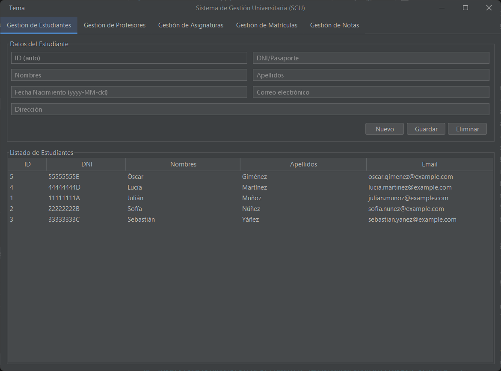
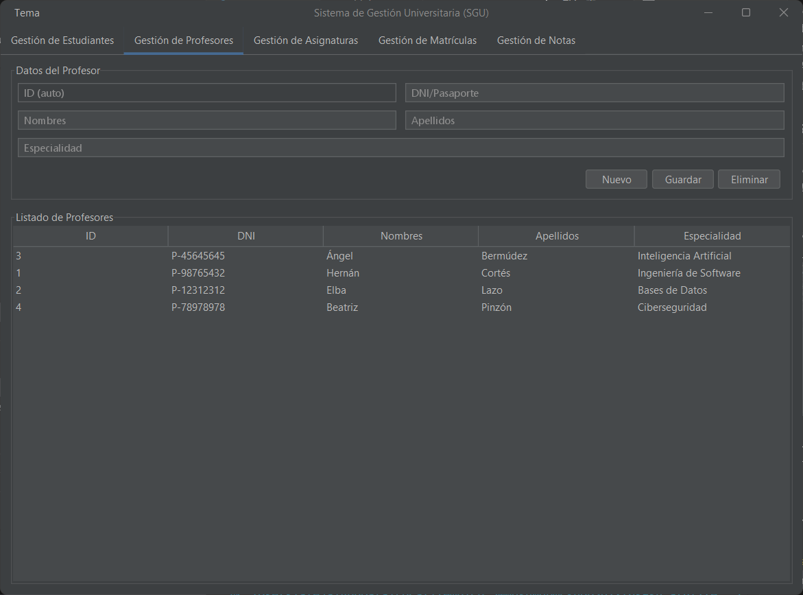
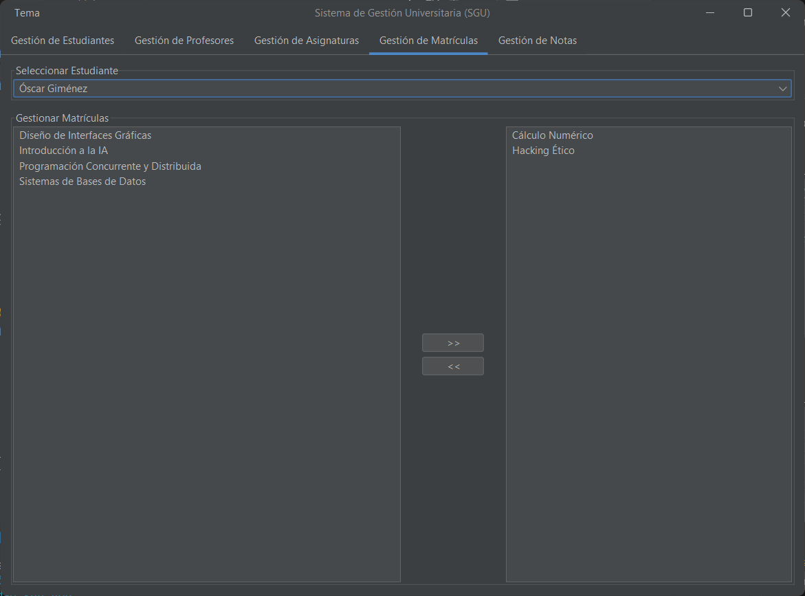

# 🎓 University System - SGU


A robust and user-friendly desktop application for managing the core operations of a university. Built with Java and Swing, this system provides a clean and modern interface for administrators to manage students, professors, subjects, and enrollments efficiently.

## ✨ Features

- **👨‍🎓 Student Management:** Add, view, update, and delete student records.
- **👨‍🏫 Professor Management:** Manage professor details and their assigned subjects.
- **📚 Subject Management:** Create and organize subjects, assign professors, and define credits.
- **📝 Enrollment & Grades:** Enroll students in subjects and manage their academic grades.
- **🔍 Search & Filter:** Quickly find information with integrated search functionalities.
- **🎨 Modern UI:** A clean and intuitive user interface thanks to the FlatLaf look and feel.

## 📸 Screenshots

*(Here you can add screenshots of the application to give a visual idea of the project)*

| Student Management | Professor Management |
| :----------------: | :------------------: |
|      **      |       **       |

| Subject Management | Enrollment & Grades |
| :----------------: | :-----------------: |
|      **      |       **      |

## 🛠️ Technologies Used

- **Backend:** Java 17
- **Build Automation:** Apache Maven
- **Database:** MySQL 8.0
- **Containerization:** Docker
- **GUI:** Java Swing
- **Look and Feel:** [FlatLaf](https://www.formdev.com/flatlaf/)
- **Dependencies:**
  - `mysql-connector-j`: For JDBC connection to MySQL.
  - `lombok`: To reduce boilerplate code.

## 🚀 Getting Started

Follow these instructions to get a copy of the project up and running on your local machine for development and testing purposes.

### Prerequisites

- [Java Development Kit (JDK) 17](https://www.oracle.com/java/technologies/javase/jdk17-archive-downloads.html) or later.
- [Apache Maven](https://maven.apache.org/download.cgi)
- [Docker](https://www.docker.com/get-started) and [Docker Compose](https://docs.docker.com/compose/install/)

### 1. Clone the Repository

```bash
git clone https://github.com/<your-username>/UniversitySystem.git
cd UniversitySystem
```

### 2. Set Up the Database with Docker

The project includes a `docker-compose.yml` file to easily set up the MySQL database in a container.

1.  **Start the database container:**
    Open a terminal in the project root and run:
    ```bash
    docker-compose up -d
    ```
    This command will pull the MySQL 8.0 image, create a container named `sgu-mysql-db`, and initialize it using the `schema.sql` script. The database will be available on `localhost:3306`.

2.  **Database Credentials:**
    The database is configured with the following credentials (as defined in `docker-compose.yml` and `db.properties`):
    - **Database:** `sgu_db`
    - **User:** `sgu_user`
    - **Password:** `sgu_password`

### 3. Build and Run the Application

The project is managed by Maven. You can build and run it using the following commands.

1.  **Build the project:**
    This command will compile the source code and package it into a JAR file in the `target` directory.
    ```bash
    mvn clean package
    ```

2.  **Run the application:**
    After a successful build, run the generated JAR file.
    ```bash
    java -jar target/sgu-system-1.0.0.jar
    ```

The application's main window should now appear.

## 🗃️ Database Schema

The database schema is automatically created and populated with sample data from the `schema.sql` file when the Docker container starts. The main tables are:

- `students`: Stores student information.
- `professors`: Stores professor information.
- `subjects`: Stores subject details and the assigned professor.
- `enrollments`: A junction table for the many-to-many relationship between students and subjects, which also stores grades.

## 📂 Project Structure

The project follows a standard Maven layout and is organized into a Model-View-Controller (MVC) architecture.

```
src/main/java/com/universidad/sgu/
├── config/      # Database configuration (DatabaseConfig.java)
├── controller/  # Controllers to handle the logic between views and models
├── model/       # Data models (Student, Professor) and DAOs (Data Access Objects)
├── view/        # Swing-based UI panels and frames
└── App.java     # Main entry point of the application
```